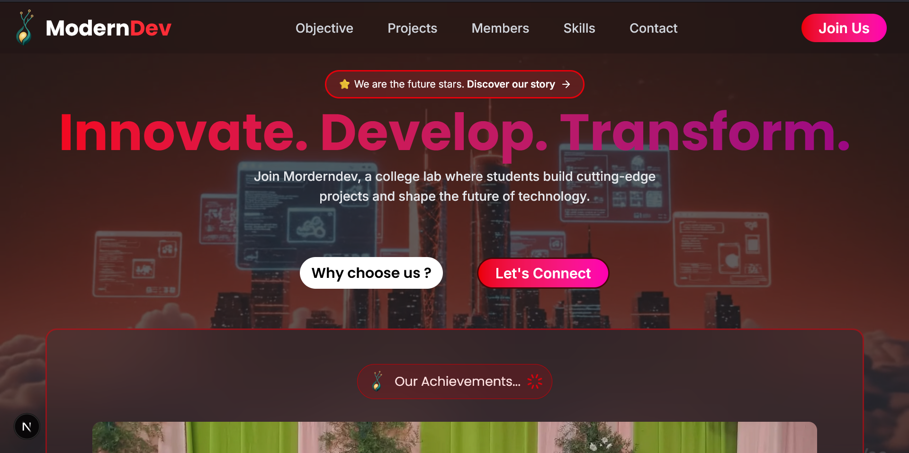

# Modern Dev



<p align="center">
  <!-- Contributors avatars auto-generated from GitHub -->
  <!-- CONTRIBUTORS:START -->
<p align="center">
  <a href="https://github.com/Nithwin" target="_blank" rel="noopener noreferrer" title="Nithwin" style="display:inline-block; margin:4px; width:48px; height:48px; border-radius:50%; overflow:hidden;">
    
  </a>
  <a href="https://github.com/Raju251004" target="_blank" rel="noopener noreferrer" title="Raju251004" style="display:inline-block; margin:4px; width:48px; height:48px; border-radius:50%; overflow:hidden;">
    
  </a>
</p>
<!-- CONTRIBUTORS:END -->
  <br />
  <!-- Live demo badges -->
  <a href="https://moderndev.vercel.app/" title="Open live demo"></a>
  <a href="https://moderndev.vercel.app/" title="Hosted on Vercel"></a>
</p>

Modern Dev is a student-run engineering lab where students build web and mobile projects to learn, collaborate, and ship real software.

## Overview

Modern Dev is an open, student-first community focused on practical learning and collaboration. We mentor one another, build small teams around projects, and maintain an accessible codebase for students to learn from and contribute to.

Key points:
- Student-focused: mentorship + hands-on experience
- Open-source: contributions welcome from students and mentors
- Modern stack: Next.js, React, Tailwind/PostCSS

## Quick start (developer)

1. Install dependencies

```powershell
npm install
```

2. Run the development server

```powershell
npm run dev
```

Open http://localhost:3000 in your browser. Edit `app/page.tsx` or components in `components/` and the site will hot-reload.

## Contributing

We keep detailed contribution instructions in `CONTRIBUTING.md`. For most contributions follow:

- Fork the repo → create a branch → make your change → open a PR.

See: [CONTRIBUTING.md](./CONTRIBUTING.md)

## Project structure

- `app/` — Next.js routes and pages
- `components/` — React components used across the site
- `public/` — static assets (images, fonts, video)

## Code of conduct

Be kind and respectful. See `CODE_OF_CONDUCT.md` for details.

## License

MIT — see [LICENSE](./LICENSE)

